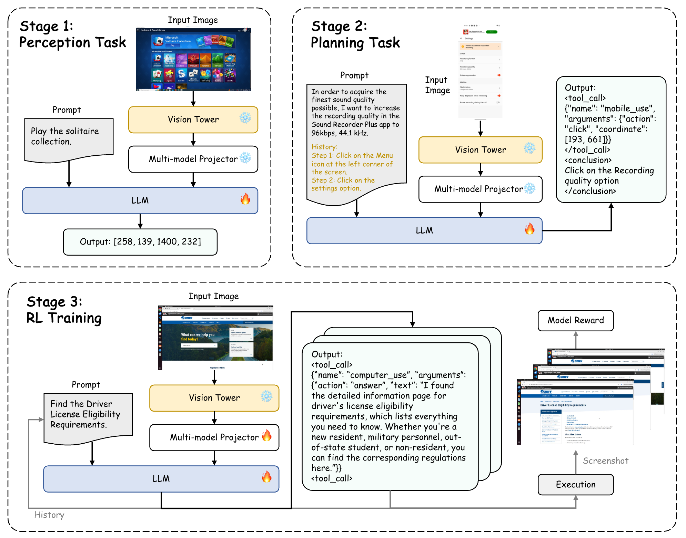

<div align="center">
  <h1>UItron: Foundational GUI Agent with Advanced Perception and Planning</h1>
</div>

<div align="center">
<!-- <a href='https://arxiv.org/abs/2507.15509'></a>&ensp;<a href='https://huggingface.co/collections/DocTron/chart-r1-68834834a239e09e9abcb5f4'></a>&ensp;<a href=https://github.com/tatsu-lab/stanford_alpaca/blob/main/LICENSE></a> -->
</a>


Zhixiong Zeng†, Jing Huang†, Liming Zheng, Wenkang Han,
Yufeng Zhong, Lei Chen, Longrong Yang, Yingjie Chu, Yuzhi He & Lin Ma*
</div>
<div align="center">
<strong>Meituan Group</strong>
</div>
<div align="center">
† Equal contribution; * Corresponding Author
</div>


---
**UItron** is an open-source vision-language model designed for automated GUI agents on mobile and PC devices. Addressing challenges such as limited operation trajectories and interactive infrastructure, UItron integrates advanced GUI perception, grounding, and planning capabilities. It employs supervised finetuning and curriculum reinforcement learning to enable complex reasoning and exploration. UItron demonstrates strong performance on open-source benchmarks and excels in Chinese app scenarios, supported by over one million manually collected operation steps from top apps. These results mark a significant step toward real-world deployment of GUI agents.
<div align="center">

</div>

## 📢 News and Updates
* ```2025.08.28``` Code and model is coming soon.
* ```2025.08.28``` 🔥🔥🔥 We release the technical report of **UItron**.


## 🤗 Models
|  Model   | Download Link  |
|  ----  | ----  |
|  UItron-7b |  -  |
|  UItron-72b  |  -   |
<!-- |  UItron-72b  |  [DocTron/Chart-R1](https://huggingface.co/DocTron/Chart-R1)   | -->

## 📊 Performance
### ScreenSpot
<table>
<thead>
  <tr>
    <th rowspan="3"></th>
    <th rowspan="3">Method</th>
    <th colspan="2">Mobile</th>
    <th colspan="2">Desktop</th>
    <th colspan="2">Web</th>
    <th rowspan="3">Avg</th>
  </tr>
  <tr>
    <th colspan="1">Text</th>
    <th colspan="1">Icon/Widget</th>
    <th colspan="1">Text</th>
    <th colspan="1">Icon/Widget</th>
    <th colspan="1">Text</th>
    <th colspan="1">Icon/Widget</th>
  </tr>
</thead>
<tbody>
  <tr>
    <td rowspan="2"><i>Agent Framework</i></td>
    <td>GPT-4o (SeeClick)</td>
    <td>81.0</td><td>59.6</td><td>69.6</td><td>33.6</td><td>43.9</td><td>26.2</td><td>52.3</td>
  </tr>
  <tr>
    <td>GPT-4o (UGround)</td>
    <td>93.4</td><td>76.9</td><td>92.8</td><td>67.9</td><td>88.7</td><td>68.9</td><td>81.4</td>
  </tr>
  <tr>
    <td rowspan="13"><i>Agent Model</i></td>
    <td>GPT-4o</td>
    <td>20.2</td><td>24.9</td><td>21.1</td><td>23.6</td><td>12.2</td><td>7.8</td><td>18.3</td>
  </tr>
  <tr>
    <td>Claude</td>
    <td>-</td><td>-</td><td>-</td><td>-</td><td>-</td><td>-</td><td>83.0</td>
  </tr>
  <tr>
    <td>Gemini 2.0</td>
    <td>-</td><td>-</td><td>-</td><td>-</td><td>-</td><td>-</td><td>84.0</td>
  </tr>
  <tr>
    <td>Qwen2.5-VL-7B</td>
    <td>-</td><td>-</td><td>-</td><td>-</td><td>-</td><td>-</td><td>84.7</td>
  </tr>
  <tr>
    <td>UGround</td>
    <td>82.8</td><td>60.3</td><td>82.5</td><td>63.6</td><td>80.4</td><td>70.4</td><td>73.3</td>
  </tr>
  <tr>
    <td>Aria-UI</td>
    <td>92.3</td><td>73.8</td><td>93.3</td><td>64.3</td><td>86.5</td><td>76.2</td><td>82.4</td>
  </tr>
  <tr>
    <td>OS-Atlas</td>
    <td>93.0</td><td>72.9</td><td>91.8</td><td>62.9</td><td>90.9</td><td>74.3</td><td>82.5</td>
  </tr>
  <tr>
    <td>AGUVIS-7B</td>
    <td>95.6</td><td>77.7</td><td>93.8</td><td>67.1</td><td>88.3</td><td>75.2</td><td>84.4</td>
  </tr>
  <tr>
    <td>AGUVIS-72B</td>
    <td>94.5</td><td>85.5</td><td>95.4</td><td>77.9</td><td>91.3</td><td>85.9</td><td>89.2</td>
  </tr>
  <tr>
    <td>UI-TARS-7B</td>
    <td>94.5</td><td>85.2</td><td>95.9</td><td>85.7</td><td>90.0</td><td>83.5</td><td>89.5</td>
  </tr>
  <tr>
    <td>UI-TARS-72B</td>
    <td>94.9</td><td>82.5</td><td>89.7</td><td>88.6</td><td>88.7</td><td>85.0</td><td>88.4</td>
  </tr>
  <tr>
    <td>UItron-7B</td>
    <td>94.1</td><td>83.8</td><td>94.8</td><td>73.6</td><td>92.2</td><td>81.1</td><td>87.7</td>
  </tr>
  <tr>
    <td>UItron-72B</td>
    <td>94.5</td><td>88.2</td><td>96.9</td><td>79.2</td><td>93.0</td><td>85.4</td><td>90.3</td>
  </tr>
</tbody>
</table>

### AndroidControl & GUI-Odyssey
<table>
  <thead>
    <tr>
      <th rowspan="2"></th>
      <th rowspan="2">Method</th>
      <th colspan="3">AndroidControl-Low</th>
      <th colspan="3">AndroidControl-High</th>
      <th colspan="3">GUI Odyssey</th>
      <th rowspan="2">Avg</th>
    </tr>
    <tr>
      <th>Type</th>
      <th>Grounding</th>
      <th>SR</th>
      <th>Type</th>
      <th>Grounding</th>
      <th>SR</th>
      <th>Type</th>
      <th>Grounding</th>
      <th>SR</th>
    </tr>
  </thead>
  <tbody>
    <tr>
      <td rowspan="2"><i>Agent Framework</i></td>
      <td>GPT-4o (SeeClick)</td>
      <td>-</td><td>-</td><td>52.8</td>
      <td>-</td><td>-</td><td>41.8</td>
      <td>-</td><td>-</td><td>-</td>
      <td>-</td>
    </tr>
    <tr>
      <td>GPT-4o (UGround)</td>
      <td>-</td><td>-</td><td>62.4</td>
      <td>-</td><td>-</td><td>48.4</td>
      <td>-</td><td>-</td><td>-</td>
      <td>-</td>
    </tr>
    <tr>
      <td rowspan="11"><i>Agent Model</i></td>
      <td>Claude</td>
      <td>74.3</td><td>0.0</td><td>19.4</td>
      <td>63.7</td><td>0.0</td><td>12.5</td>
      <td>60.9</td><td>0.0</td><td>3.1</td>
      <td>26.0</td>
    </tr>
    <tr>
      <td>GPT-4o</td>
      <td>74.3</td><td>0.0</td><td>19.4</td>
      <td>66.3</td><td>0.0</td><td>20.8</td>
      <td>34.3</td><td>0.0</td><td>3.3</td>
      <td>24.3</td>
    </tr>
    <tr>
      <td>InternVL-2</td>
      <td>90.9</td><td>84.1</td><td>80.1</td>
      <td>84.1</td><td>72.7</td><td>66.7</td>
      <td>82.1</td><td>55.5</td><td>51.5</td>
      <td>74.2</td>
    </tr>
    <tr>
      <td>SeeClick</td>
      <td>93.0</td><td>73.4</td><td>75.0</td>
      <td>82.9</td><td>62.9</td><td>59.1</td>
      <td>71.0</td><td>52.4</td><td>53.9</td>
      <td>69.3</td>
    </tr>
    <tr>
      <td>Aria-UI</td>
      <td>-</td><td>87.7</td><td>67.3</td>
      <td>-</td><td>43.2</td><td>10.2</td>
      <td>-</td><td>86.8</td><td>36.5</td>
      <td>-</td>
    </tr>
    <tr>
      <td>OS-Atlas</td>
      <td>93.6</td><td>88.0</td><td>85.2</td>
      <td>85.2</td><td>78.5</td><td>71.2</td>
      <td>84.5</td><td>67.8</td><td>62.0</td>
      <td>79.6</td>
    </tr>
    <tr>
      <td>AGUVIS</td>
      <td>-</td><td>-</td><td>80.5</td>
      <td>-</td><td>-</td><td>61.5</td>
      <td>-</td><td>-</td><td>-</td>
      <td>-</td>
    </tr>
    <tr>
      <td>UI-TARS-7B</td>
      <td>98.0</td><td>89.3</td><td>90.8</td>
      <td>83.7</td><td>80.5</td><td>72.5</td>
      <td>94.6</td><td>90.1</td><td>87.0</td>
      <td>87.4</td>
    </tr>
    <tr>
      <td>UI-TARS-72B</td>
      <td>98.1</td><td>89.9</td><td>91.3</td>
      <td>85.2</td><td>81.5</td><td>74.7</td>
      <td>95.4</td><td>91.4</td><td>88.6</td>
      <td>88.5</td>
    </tr>
    <tr>
      <td>UItron-7B</td>
      <td>95.8</td><td>90.7</td><td>88.2</td>
      <td>96.1</td><td>87.1</td><td>86.9</td>
      <td>95.3</td><td>85.7</td><td>84.8</td>
      <td>90.1</td>
    </tr>
    <tr>
      <td>UItron-72B</td>
      <td>96.5</td><td>97.1</td><td>92.8</td>
      <td>96.7</td><td>94.2</td><td>92.4</td>
      <td>94.4</td><td>86.3</td><td>86.1</td>
      <td>92.9</td>
    </tr>
  </tbody>
</table>

### Osworld
<table>
  <thead>
    <tr>
      <th>Model</th>
      <th>OSWorld</th>
    </tr>
  </thead>
  <tbody>
    <tr>
      <td colspan="2"><b>Compute-Use Agent (CUA)</b></td>
    </tr>
    <tr>
      <td>OpenAI CUA</td>
      <td>26.0</td>
    </tr>
    <tr>
      <td>Claude CUA</td>
      <td>31.2</td>
    </tr>
    <tr>
      <td>OpenCUA-32B</td>
      <td>29.7</td>
    </tr>
    <tr>
      <td colspan="2"><b>GUI Agent</b></td>
    </tr>
    <tr>
      <td>Qwen2.5-VL-72B</td>
      <td>4.4</td>
    </tr>
    <tr>
      <td>Augvis-72B</td>
      <td>10.3</td>
    </tr>
    <tr>
      <td>UI-TARS-7B</td>
      <td>18.7</td>
    </tr>
    <tr>
      <td>UI-TARS-1.5-7B</td>
      <td>23.3</td>
    </tr>
    <tr>
      <td>UI-TARS-72B</td>
      <td>22.7</td>
    </tr>
    <tr>
      <td>UItron-72B</td>
      <td>23.3</td>
    </tr>
  </tbody>
</table>
<!--
Table: Task Success Rates (SR) on OSWorld. Results are reported on the official verified environment (i.e., OSWorld-verified) that fixes several issues.
-->

### Chinese mobile Apps
<table>
  <thead>
    <tr>
      <th>Method</th>
      <th>Step SR</th>
      <th>Task SR</th>
    </tr>
  </thead>
  <tbody>
    <tr>
      <td colspan="3"><b>Offline Environment</b></td>
    </tr>
    <tr>
      <td>UI-TARS-7B</td>
      <td>75.1</td>
      <td>22.4</td>
    </tr>
    <tr>
      <td>UI-TARS-72B</td>
      <td>80.5</td>
      <td>32.8</td>
    </tr>
    <tr>
      <td>UI-TARS-1.5-7B</td>
      <td>77.4</td>
      <td>29.3</td>
    </tr>
    <tr>
      <td>UItron-7B</td>
      <td>82.7</td>
      <td>40.5</td>
    </tr>
    <tr>
      <td><b>UItron-72B</b></td>
      <td><b>84.1</b></td>
      <td><b>47.4</b></td>
    </tr>
  </tbody>
</table>
<!-- Table: Offline evaluation results on top-tier Chinese mobile Apps. -->

<!-- 
## 🔍 Usage Example
Below is a simple example of how to use Chart-R1 for multimodal reasoning tasks:
```python
from transformers import Qwen2_5_VLForConditionalGeneration, AutoProcessor
from qwen_vl_utils import process_vision_info

# Load model
model_path = 'DocTron/Chart-R1'

# Load the model on the available device(s)
model = Qwen2_5_VLForConditionalGeneration.from_pretrained(
    model_path, torch_dtype="auto", device_map="auto", attn_implementation="flash_attention_2"
)

# Use the following system_prompt and pixel range by default
system_prompt = "Solve the question. The user asks a question, and you solves it. You first thinks about the reasoning process in the mind and then provides the user with the answer. The reasoning process and answer are enclosed within <think> </think> and <answer> </answer> tags, respectively, i.e., <think> Since 1+1=2, so the answer is 2. </think><answer> 2 </answer>, which means assistant's output should start with <think> and end with </answer>."

processor = AutoProcessor.from_pretrained(model_path, min_pixels=1280*28*28, max_pixels=16384*28*28)

# Set generation parameters by default
generate_kwargs = dict(
    max_new_tokens=2048,
    top_p=0.001,
    top_k=1,
    temperature=0.01,
    repetition_penalty=1.0
)

# Prepare input with image and text
messages = [
    {
        "role": "system",
        "content": system_prompt
    },
    {
        "role": "user",
        "content": [
            {
                "type": "image",
                "image": "assets/example_case.jpg",
            },
            {"type": "text", "text": "What is the difference in percentage of U.S. people who thinks scientists should take active part in policy debates and those thinks they should focus on establishing sound scientific facts?"},
        ],
    }
]

# Preparation for inference
text = processor.apply_chat_template(
    messages, tokenize=False, add_generation_prompt=True
)
image_inputs, video_inputs = process_vision_info(messages)
inputs = processor(
    text=[text],
    images=image_inputs,
    videos=video_inputs,
    padding=True,
    return_tensors="pt",
)
inputs = inputs.to(model.device)

# Inference: Generation of the output
generated_ids = model.generate(**inputs, **generate_kwargs)
generated_ids_trimmed = [
    out_ids[len(in_ids) :] for in_ids, out_ids in zip(inputs.input_ids, generated_ids)
]
output_text = processor.batch_decode(
    generated_ids_trimmed, skip_special_tokens=True, clean_up_tokenization_spaces=False
)
print(output_text[0])

# <think>Step 1: Identify the percentage of U.S. people who think scientists should 'Take an active role in policy debates'. This is 60%. Step 2: Identify the percentage of U.S. people who think scientists should 'Focus on establishing sound scientific facts'. This is 39%. Step 3: Calculate the difference between these two percentages: 60% - 39% = 21%.</think><answer>21</answer>
``` -->


## 📌 Acknowledgement
We sincerely appreciate [LLaMA-Factory](https://github.com/hiyouga/LLaMA-Factory), [OpenRLHF](https://github.com/OpenRLHF/OpenRLHF) and [ZeroGUI](https://github.com/OpenGVLab/ZeroGUI) for providing reference training framework.


<!-- ## 📖 Citation
If you find this project useful, please feel free to leave a star and cite our paper:
```
@misc{chen2025chartr1,
      title={Chart-R1: Chain-of-Thought Supervision and Reinforcement for Advanced Chart Reasoner}, 
      author={Lei Chen and Xuanle Zhao and Zhixiong Zeng and Jing Huang and Yufeng Zhong and Lin Ma},
      year={2025},
      eprint={2507.15509},
      archivePrefix={arXiv},
      primaryClass={cs.AI},
      url={https://arxiv.org/abs/2507.15509}, 
}
``` -->
